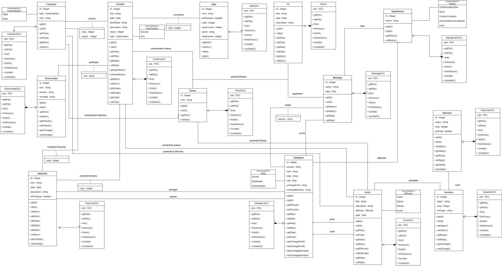

# SAE3.01 - Video Home Share (VHS)

## A propos du projet
Video Home Share est une application web responsive autour des films et séries.
Tout d'abord, l'application possède une base de données répertoriant les films et les séries.
Grâce à cette base de données, les utilisateurs peuvent concevoir des watchlists afin de faire des listes sur différents contenus.
Video Home Share propose également un forum où les utilisateurs pourront discuter de leurs contenus préférés.
L'application propose aussi des quizz qui seront fait par la communauté sur un thème et/ou du contenu.
Enfin, nous pensons proposer le Watch Together, une fonctionnalité permettant aux utilisateurs dans une même salle virtuelle de regarder du contenu en même temps.
 
 

## Diagramme de classes

 
 

## Architecture technique
### Frontend
HTML, CSS, TWIG
### Backend
PHP
### Base de données
SQL
### API
 
 

## Sécurité
OpenSSL
 
OAUTH2
 
 

## Hébergement
phpMyAdmin
 
 

## Journalisation (suivi des activités, logs)
ELK Stack
 
 

## Technologies utilisées
HTML, CSS, SCSS, PHP, JSON, YAML, TWIG, BOOTSTRAP
 
 

## Instructions pour l'installation et l'utilisation
### Installer
 
 

### Utiliser
 
 
